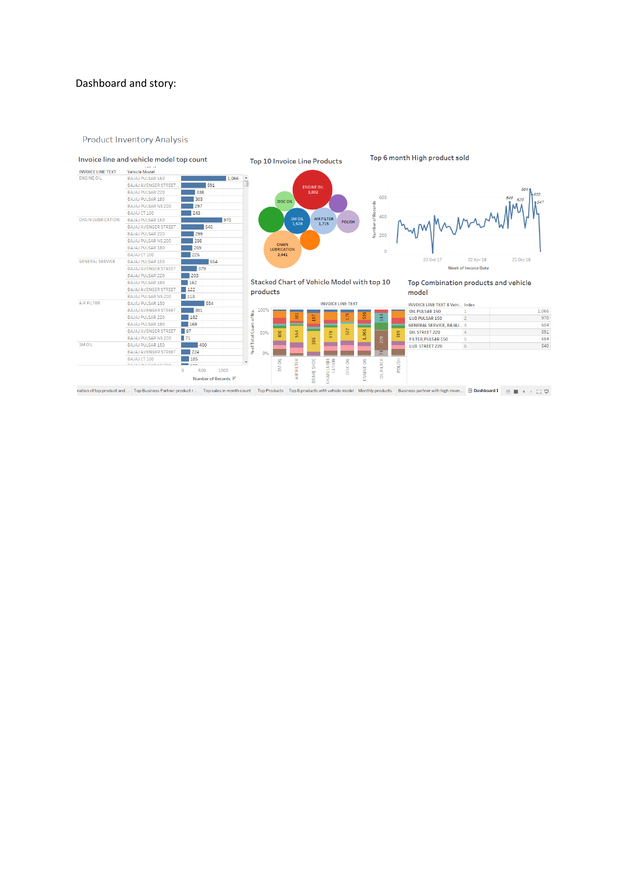

# Spare-Parts-Inventoryy

Business Case:

In this business case it is on the inventory management. Keeping Inventory of spare in various service centre to the market demand is always a challenge as most service centres 
spends significant amount in spare parts inventory costs. In spite of this, availability of spare parts is been one of the problem areas.

Project Description(Solution):

At first the data was extracted which in the form of excel sheet and loading data in to the jupyter notebook. At first changing columns names and seeing which are top important 
spares and vehicle model. After that Combining spares and vehicle model of top 10 and it is visualised even in matplot and even in tableau it is visualised. Specifically in 
Tableau each and every product and vehicle is visualised so for easy understanding. 

So after selection of top 10 combined spares and vehicle it is then forecasted with time series.

In time series the algorithm used was Autoregressive Model, Autoregressive integrated moving average, SARIMAX FORECAST but founded that SARIMAX FORECAST is most effective 
prediction for 6 months. Above ml model is attcahed and even tableau visulaisation.

Tableau Visualisation of spare parts inventory(dashboard):

